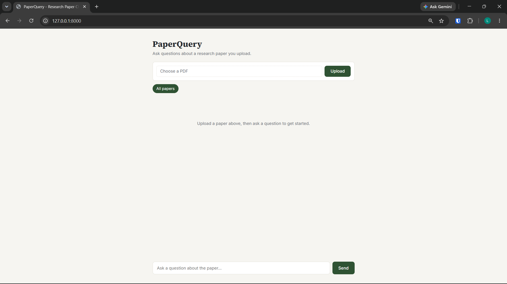
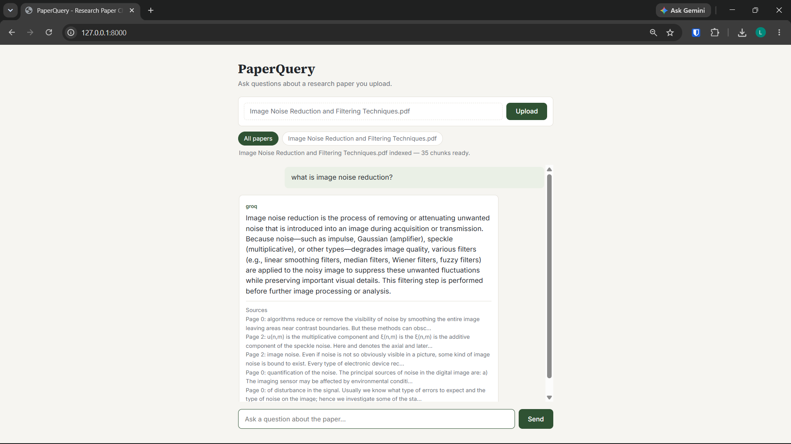

# PaperQuery - Research Paper Chatbot

A simple RAG-based chatbot that lets you upload research papers (PDFs) and ask questions about them. Combines semantic search and keyword search (hybrid retrieval) to find relevant context before generating an answer.

## Features

- Upload any PDF research paper
- Hybrid search: semantic (Chroma + embeddings) + keyword (BM25), merged with Reciprocal Rank Fusion
- LLM generation via Gemini, with automatic fallback to Groq if Gemini fails
- Answers include cited source pages
- Filter chat to a specific paper or search across all uploaded papers
- Simple web UI (no framework, plain HTML/CSS/JS)

## Tech Stack

- **Backend:** FastAPI
- **Orchestration:** LangChain
- **Vector Store:** ChromaDB
- **Keyword Search:** BM25 (rank_bm25)
- **Embeddings:** HuggingFace (`sentence-transformers`)
- **LLMs:** Gemini (primary), Groq (fallback)
- **Frontend:** HTML, CSS, JavaScript

## Setup

1. Clone the repo and create a virtual environment:
```bash
   git clone <repo-url>
   cd research-paper-chatbot
   python -m venv venv
   source venv/bin/activate   # Windows: venv\Scripts\activate
```

2. Install dependencies:
```bash
   pip install -r requirements.txt
```

3. Create a `.env` file in the root directory and include the API keys for Gemini and Groq.

4. Run the app:
```bash
   uvicorn app.main:app --reload
```

5. Open your browser at `http://127.0.0.1:8000`

## How It Works

1. **Upload** a PDF → it's split into chunks and indexed in both Chroma (semantic) and BM25 (keyword)
2. **Ask a question** → hybrid search retrieves the most relevant chunks using both methods, merged via Reciprocal Rank Fusion
3. **Answer generation** → the question and retrieved context are sent to Gemini; if Gemini fails, Groq is used as a fallback
4. **Response** includes the answer, which LLM served it and the source pages used

## Project Structure

```
app/
├── ingestion/     # PDF loading and chunking
├── retrieval/     # Vector store, keyword store, hybrid search
├── generation/    # LLM clients (Gemini, Groq) and fallback router
├── chains/        # RAG pipeline orchestration
├── api/           # FastAPI routes
├── core/          # Configuration
└── data/          # Store ChromaDB data and uploaded files
static/
├── index.html
├── style.css
└── script.js
requirements.txt
```

## Screenshots





## Notes

- BM25 index is in-memory and rebuilds on server restart (Chroma persists to disk automatically)
- This is a demo project — built manually step by step to understand RAG architecture
